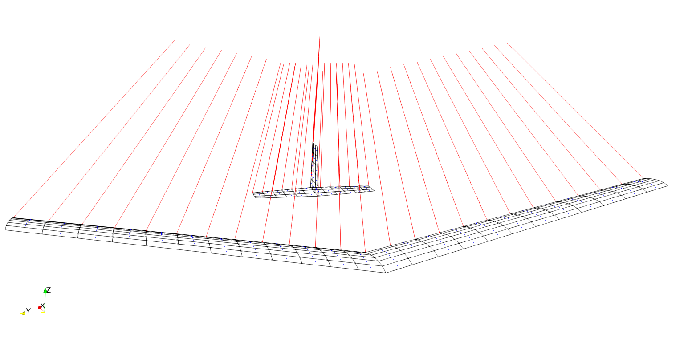

# VortexLattice

[](https://flow.byu.edu/VortexLattice.jl/stable)
[](https://flow.byu.edu/VortexLattice.jl/dev)


*A Comprehensive Julia implementation of the Vortex Lattice Method*

Authors: Taylor McDonnell and Andrew Ning

**VortexLattice** is a comprehensive pure-Julia implementation of the vortex lattice method for both steady and unsteady flow conditions.  It is designed to be fast, accurate (within theoretical limitations), easy to use, and applicable to arbitrary geometries and velocity fields.  Its steady analysis capabilities have been extensively verified against results generated using AVL and its unsteady analysis capabilities have been verified against unsteady vortex lattice method results generated by Katz and Plotkin.



## Package Features
- Vortex Ring Panels
  - Cambered lifting surfaces
  - Trailing vortices in user-specified direction
  - Optional finite-core model
- Convenient geometry generation
  - From pre-existing grid
  - From lifting surface parameters
  - Symmetric geometries
  - Multiple lifting surfaces
- Multiple discretization schemes
  - Uniform
  - Sine
  - Cosine
- General freestream description
  - Freestream flow angles
  - Aircraft rotation components
  - Additional velocity as a function of location
- Free/Fixed Wakes
  - Free wakes through unsteady analysis
  - Fixed wakes through steady analysis
- Multiple analyses
  - Steady analysis
  - Unsteady (time-domain) analysis
  - Near field forces
  - Far field drag
  - Body and stability derivatives
- Geometry and wake visualization using [WriteVTK](https://github.com/jipolanco/WriteVTK.jl)
- Extensively verified against computational results.

## Installation

Enter the package manager by typing `]` and then run the following:

```julia
pkg> add VortexLattice
```

## Performance

This code has been optimized to be highly performant, primarily by maintaining type stability and minimizing allocations.  It should outperform vortex lattice method codes written in other higher level languages.  However, it does not yet incorporate the fast multipole method to speed up wake computations, so its performance can still be improved.

## Usage

See the [documentation](https://flow.byu.edu/VortexLattice.jl/dev)

## References
<a id="1">[1]</a>
Drela, M. Flight Vehicle Aerodynamics. MIT Press, 2014.

<a id="2">[2]</a>
Katz, J., and Plotkin A. Low-Speed Aerodynamics. Cambridge University Press, 2001.
