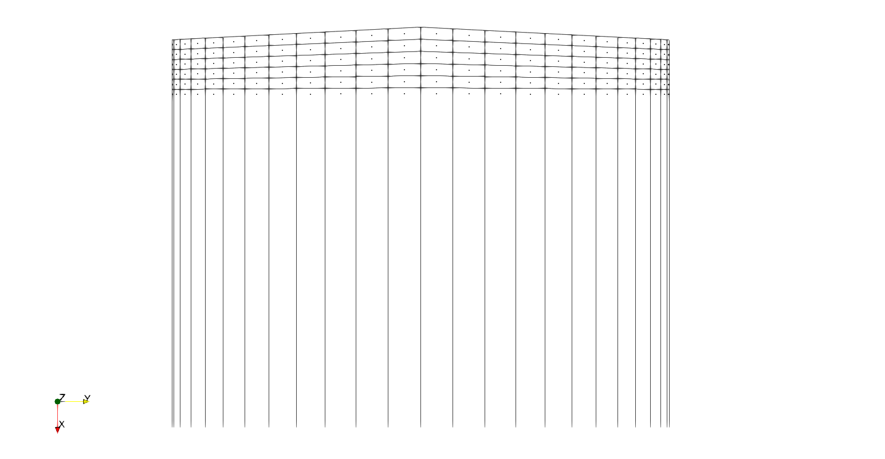

# Guide

This guide demonstrates the basic capabilities of using VortexFlow.  First, we need to load the package.

```@example guide
using VortexFlow
```

Then we need to create our geometry.  While VortexFlow can handle multiple lifting surfaces, for this guide we will be analyzing a planar wing with the following geometric properties.

```@example guide
xle = [0.0, 0.4] # leading edge x-position
yle = [0.0, 7.5] # leading edge y-position
zle = [0.0, 0.0] # leading edge z-position
chord = [2.2, 1.8] # chord length
theta = [2.0*pi/180, 2.0*pi/180] # twist (in radians)
phi = [0.0, 0.0] # section rotation about the x-axis
```

Note that we are only defining half the wing since the wing is symmetric about the y-axis.

We also need to define the number of panels and the discretization scheme in the spanwise and chordwise directions.  There are currently three discretization
scheme options: `Uniform()`, `Sine()`, and `Cosine()`.  To maximize the accuracy of our analysis we would like to use cosine spacing in the spanwise direction.  To do this, we need to use sine spacing on the right half of the wing (since once reflected across the y-z plane, sine spacing become cosine spacing).  

```@example guide
ns = 12 # number of spanwise panels
nc = 6  # number of chordwise panels
spacing_s = Sine() # spanwise discretization scheme
spacing_c = Uniform() # chordwise discretization scheme
```

Now that we have defined our geometry and discretization scheme we can generate the panels using `wing_to_horseshoe_vortices` or `wing_to_vortex_rings`.  Using vortex rings allows us to model camber and twist in the panel geometry (rather than just in the boundary conditions), however, since our sections have no camber and only a small amount of twist there is essentially no difference between the results using the two vortex panel types.  

```@example guide
panels = wing_to_horseshoe_vortices(xle, yle, zle, chord, theta, phi, ns, nc;
    spacing_s=spacing_s, spacing_c=spacing_c, mirror=true)
```

Note that we used the keyword argument `mirror` to create a copy of our geometry, reflected across the X-Z plane.

Now that we have generated our geometry we need to define our reference parameters and freestream properties. We use the following reference parameters

```@example guide
Sref = 30.0 # reference area
cref = 2.0  # reference chord
bref = 15.0 # reference span
rref = [0.50, 0.0, 0.0] # reference location for rotations/moments (typically the c.g.)
ref = Reference(Sref, cref, bref, rref)
```

We also use the following flow conditions
```@example guide
alpha = 1.0*pi/180 # angle of attack
beta = 0.0 # sideslip angle
Omega = [0.0, 0.0, 0.0] # rotational velocity around the reference location
fs = Freestream(alpha, beta, Omega)
```

Now that we have all the components necessary for our analysis we can perform the core computation of the vortex lattice method: calculate panel circulation.
```@example guide
AIC = influence_coefficients(panels)
b = normal_velocity(panels, ref, fs)
Γ = circulation(AIC, b)
```

We can then use the circulation distribution combined with the Kutta-Joukowski theory to find the forces and moments on the aircraft.

```@example guide
CF, CM, panelprops = near_field_forces(panels, ref, fs, Γ)
```

By default `CF` and `CM` are returned in the body frame, but we can easily return them in the wind frame using the `frame` keyword argument.

```@example guide
CF, CM, panelprops = near_field_forces(panels, ref, fs, Γ; frame=Wind())
```

Numerical noise often corrupts drag estimates from near-field analyses (such as the previous analysis), therefore, it is often more accurate to compute drag in the farfield on the Trefftz plane.

```@example guide
CDiff = far_field_drag(panels, ref, fs, Γ)
```

We can also compute body or stability derivatives for the aircraft.

```@example guide
dCFb, dCMb = body_derivatives(panels, ref, fs, AIC)
dCFs, dCMs = stability_derivatives(panels, ref, fs, AIC)
```

Finally, we can visualize our geometry using ParaView.

```julia
write_vtk("simplewing", panels)
```


